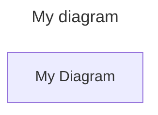

# @mermaidchart/cli

CLI for interacting with https://MermaidChart.com, the platform that makes collaborating with Mermaid diagrams easy!

## Installation

`@mermaidcart/cli` is tested to work with Node.JS v18.18.0 or later.

We recommend installation using [npx](https://docs.npmjs.com/cli/v10/commands/npx)
to automatically download, cache, and run `@mermaidcart/cli`, as it comes with
most Node.JS installations.

```bash
npx @mermaidchart/cli --help
```

## Usage

```bash
npx @mermaidchart/cli <command>
```

Use `--help` to see options!

```bash
npx @mermaidchart/cli --help
```

`@mermaidchart/cli` allows you to easily sync local diagrams with your diagrams
on https://mermaidchart.com.

### `login`

Firstly, go to https://www.mermaidchart.com/app/user/settings and generate an
API key, which you can then setup by running:

```bash
npx @mermaidchart/cli login
```

### `link` an existing Mermaid diagram to MermaidChart.com

You can link a local Mermaid diagram to MermaidChart using:

```bash
npx @mermaidchart/cli link ./path/to/my/mermaid-digram.mmd
```

This will add an `id: xxxx-xxxxx-xxxxx` field to your diagram's YAML frontmatter,
which points to the diagram on MermaidChart.com:

````markdown

````

### `push` local changes to MermaidChart.com

Once you've made some local changes, you can `push` your changes to MermaidChart.com

```console
$ npx @mermaidchart/cli push ./path/to/my/mermaid-digram.mmd
✅ - ./path/to/my/mermaid-digram.mmd was pushed
```

### `pull` changes from MermaidChart.com

You can use `pull` to pull down changes from MermaidChart.com.

```console
$ npx @mermaidchart/cli pull ./path/to/my/mermaid-digram.mmd
✅ - ./path/to/my/mermaid-digram.mmd was updated
```

Or use the `--check` flag to throw an error if your local file would have been
updated:

```console
$ npx @mermaidchart/cli pull ./path/to/my/mermaid-digram.mmd
❌ - ./path/to/my/mermaid-digram.mmd would be updated
```

## Contributing

For local development and testing, you can `pnpm dev` to run the CLI,
`pnpm run lint` to run linting, and `pnpm test` to run unit tests.
