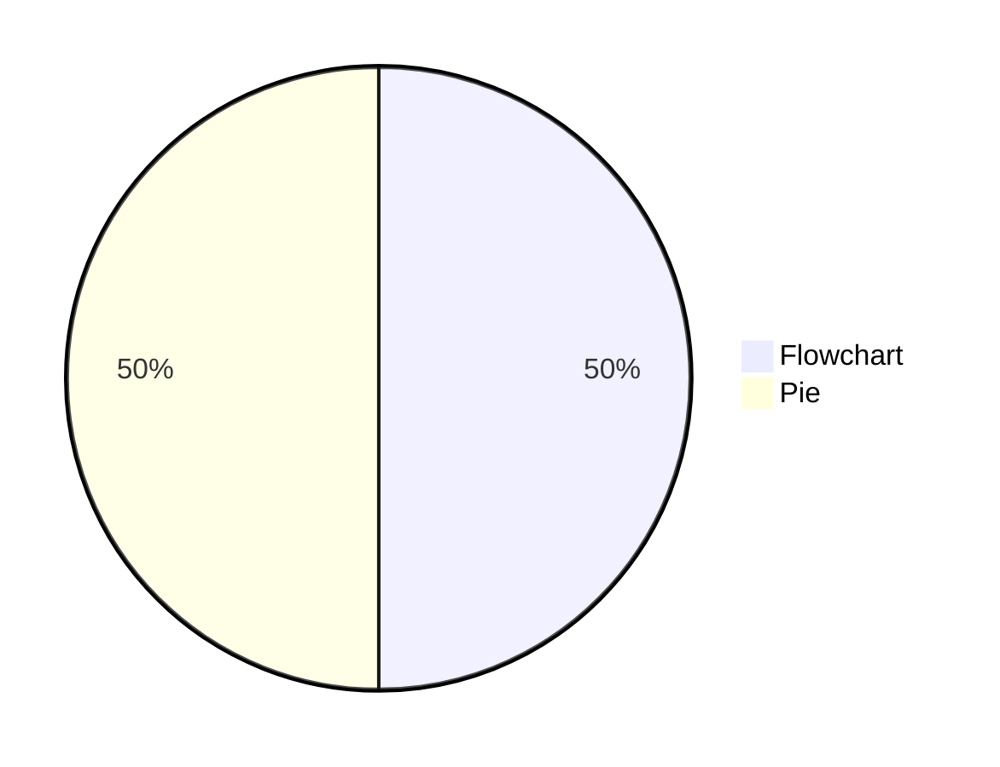

# Test markdown file with linked diagrams

Here is a markdown comment: <!-- Hello World -->

This is a flowchart diagram

```mermaid
---
id: https://test.mermaidchart.invalid/d/xxxxxxx-flowchart
---
flowchart
    A[Hello World]
```

While this is a pie diagram

```mermaid
---
id: https://test.mermaidchart.invalid/d/xxxxxxx-pie
---
pie
    "Flowchart" : 1
    "Pie" : 1
```
