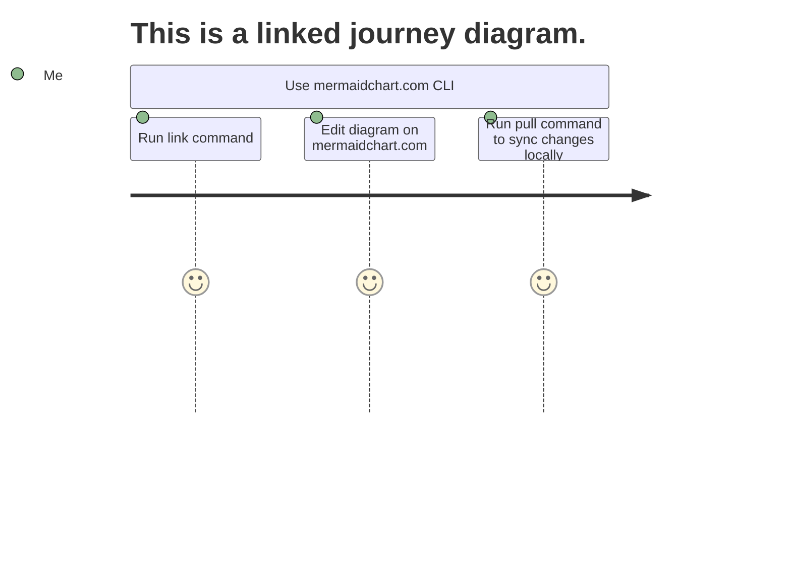
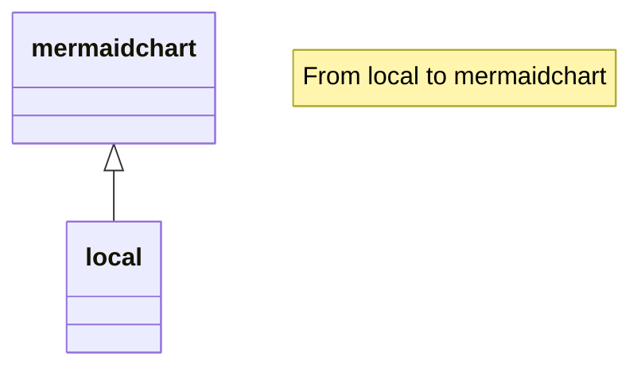

# Test markdown file with some linked diagrams and some unlinked diagrams

Here is a markdown comment: <!-- Hello World -->

This is a journey diagram that is already linked.

This is a class diagram that isn't linked.

